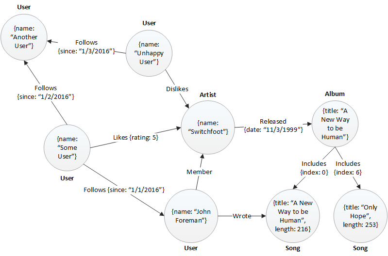

# Ooluroo Challenge
This repository contains the submission for Justin Albano to the Ooluroo programming challenge presented by Corey Wendling on Nov. 1, 2016. This submission contains all source code, artifacts and documents, and schemas required to comprehensively solve the presented problem.

## Notes
 - SQL schema contained in `src/main/resources/schema.sql`
 - All notes and hand-drawn designs contained in `doc/`

## RESTful Endpoints
| Method        | URI           | Description  |
|:-------------|:-------------|:-----|
| `GET` | `/albums` | Returns a list of all existing albums |
| `GET` | `/albums?filter={pattern}` | Returns a list of all existing albums whose title conform to the supplied pattern |
| `PUT` | `/albums` | Creates a new album with the supplied characteristics; returns the ID of the newly created album |
| `GET` | `/albums/{id}` | Returns a representation of the album corresponding to the supplied ID |
| `PUT` | `/albums/{id}` | Updates the data associated with the album corresponding to the supplied ID |
| `DELETE` | `/albums/{id}` | Deletes the album corresponding to the supplied ID |
| `GET` | `/albums/{album_id}/songs` | Returns a list of all songs associated with the album corresponding to the supplied album ID |
| `PUT` | `/albums/{album_id}/songs` | Creates a new song with the supplied characteristics and adds it to the album correspond to the supplied album ID; returns the ID of the newly created album; the album ID of the supplied song is ignored (the `{album_id}` is used instead) |
| `GET` | `/songs` | Returns a list of all existing songs |
| `GET` | `/songs?filter={pattern}` | Returns a list of all existing songs whose title conforms to the supplied pattern |
| `GET` | `/songs/{id}` | Returns a representation of the song corresponding to the supplied ID |
| `PUT` | `/songs/{id}` | Updates the data associated with the song corresponding to the supplied ID |
| `DELETE` | `/songs/{song_id}` | Deletes the song corresponding to the supplied ID |

## With More Time
The following are the simplifying assumptions made due to the time constraint of the project, as well as the vision that the project could include, given more time were provided.
 - **A larger battery of tests**: Currently, the RESTful API is tested at an acceptance level, where a series of API calls are made to ensure that an end-user interacting with the system obtains the expected results. For example, executing a `PUT` command to create a new album is verified using a `GET` command to obtain a list of the existing albums and ensuring that the newly created album is contained in this list. In addition to this set of tests, given more time, a more targetted set of unit and integration tests would be created. These tests would include the following:
 
    - Unit tests for the Data Access Objects (DAOs)
    - Integration tests that exercise the system response when the database cannot be reached
    - Timing tests that stress the system to ensure that no indefinite or non-returning calls are made (i.e. ensure that timeouts and circuit breakers are in place in case a call to an external service, such as a database, does not lock up the system or hang indefinitely if it cannot be complete)
    - Unit tests for failure cases (i.e. what happens if the payload to an API call is incorrect?)
    - Stress tests to ensure that the system executes in a reasonable time under heavy load
    
 - **More expressive failure interface**: Add a defined set of responses when errors occur
 
 - **Model system as a graph database**: Instead of using a relational database, a graph database can be used to model the relationships between songs, albums, users, artists, etc. in a more complex manner than a relational database. This allows the service provider to gain useful insight into the data it has obtained. For example, if a user has followers and those followers like specific artists and albums, a query can be (relatively) easily created to gain insight into "what artists do followers of this user like?" An example of the graph structure is illustrated in the follow figure:
 
 
 
 This graph contains complex relationships that would otherwise be difficult to model and query in a relational database language. Using a graph database, these relationships and nodes map directly into efficient storage and can be efficiently queried to obtain information that is useful for both the user and the service provider.

 - **Increased security**: Since patterns can be used to search for albums and songs, a great deal of security would be needed. For example, the pattern supplied in the URL of an API call should be santized to ensure that it does not include SQL injection payloads or other types of malicious information. In addition, a cryptographic API key should be introduced that restricts access to the API to approved entities. These entities can obtain a signed certificate from the service provider and then include the certificate in the API calls that they make. For example, instead of simply making a `GET` call such as `/albums`, the call would be required to include the API key: `/albums?key=eb72c3541ce3eae9992b0cf506950ce98a8483a6a97dcb111e5547f03a1758d3`. This creates a stateless means of authenticating API access; if instead, a more connection oriented API were used, the key may be provided during handshaking and may be left off of API calls for the duration of the connection. 
 
 The use of a key also unique identifies the accessor of the API, allowing useful metrics to be gathered (how many of each call were made by an acessor) or limit the number of calls that an accessor can make. For example, a free account may only be able to make 60 calls per minute, while a paid account may make 600 calls per minute.
 
## Test Cases
The following tests cases are by no means a comprehensive set of tests, but given the time, targets the basic functionality that is expected from a first iteration of the music application.

| Test Case        | Expected Result  |
|:-------------|:-------------|
| PUT album &rarr; GET album | Ensure created album can be obtained |
| PUT album &rarr; DELETE album &rarr; GET album | Ensure created (then deleted album) cannot be obtained |
| PUT album &rarr; GET album (matching pattern) | Ensure created album can be obtained |
| PUT album &rarr; GET album (non-matching pattern) | Ensure created album cannot be obtained | 
| PUT album &rarr; GET ALL albums | Ensure newly created album is in list |
| PUT album song &rarr; GET album song | Ensure created song can be obtained |
| PUT album song &rarr; DELETE song &rarr; GET album song | Ensure created song cannot be obtained |
| PUT existing album (with changes) &rarr; GET album | Ensure that the album is updated |
| PUT existing song (with changes) &rarr; GET song | Ensure that the song is updated |
| PUT album song &rarr; GET ALL songs | Ensure created song is in list |
| PUT song &rarr; DELETE song &rarr; GET ALL songs | Ensure created song is not present in list |
| PUT song &rarr; GET song (matching pattern) | Ensure created song is found in list |
| PUT song &rarr; GET song (non-matching pattern) | Ensure created song is not found in list |

